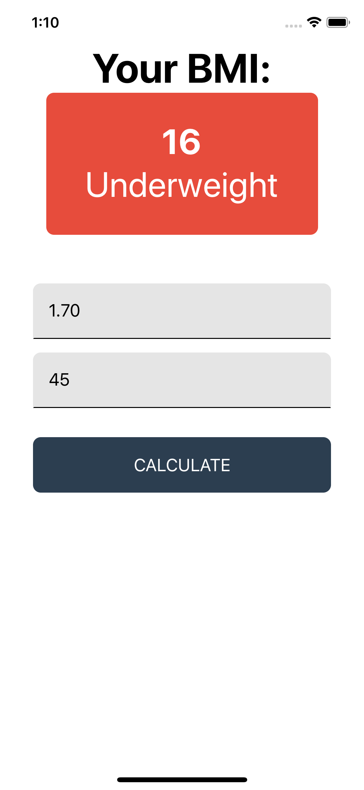
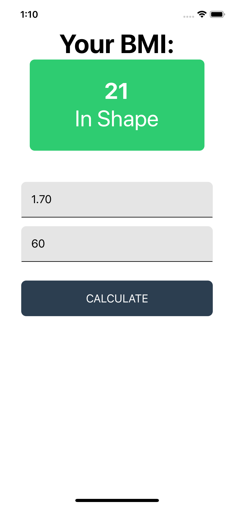
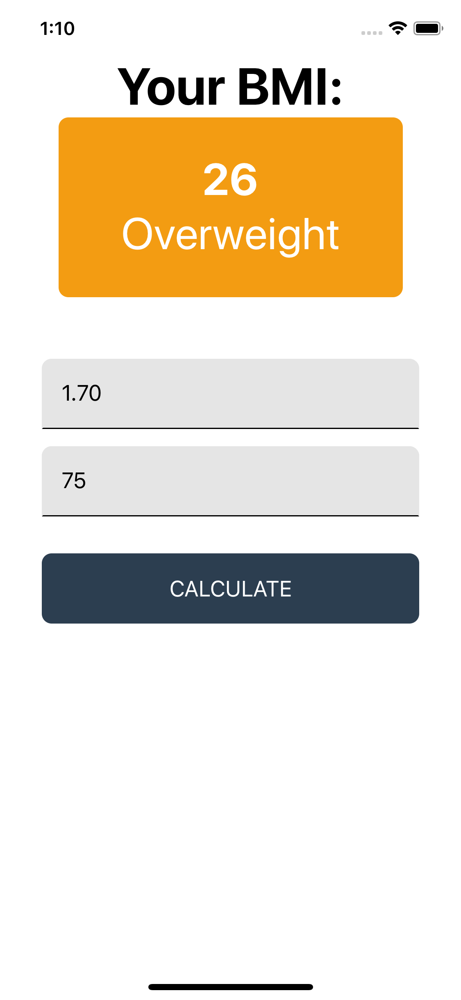
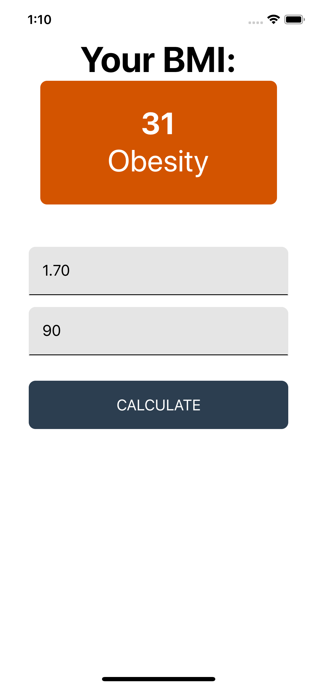
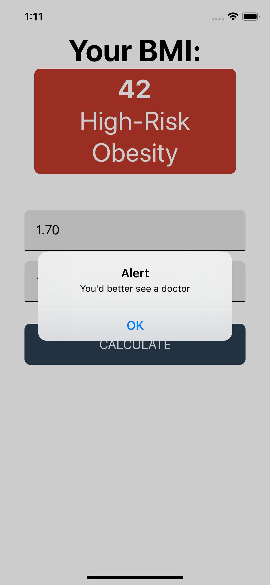
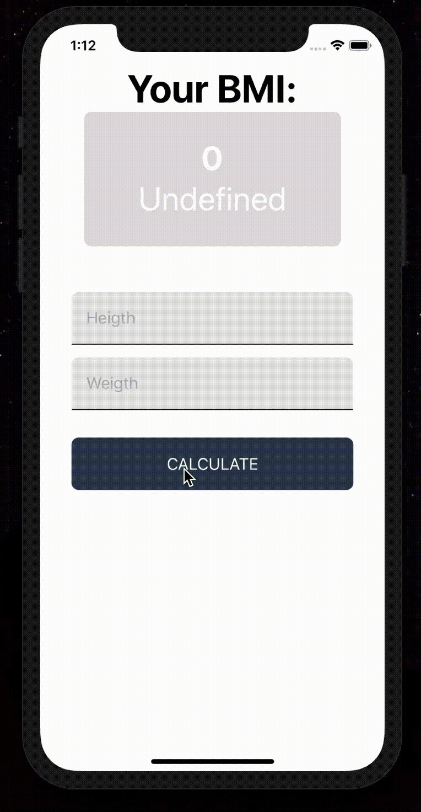

# BMI Calculator

	

    
 </a>

 

## :information_source: Info

  This is my first Ract Native App developed in the online course "Meu Primeiro Aplicativo", My First Application in english, conducted and designed by Felipe Fontoura from Dev Samurai.

## About 
* **Platform:** iOS & Android

* **Related Articles:** 
### [React Native Basics: Componentes Funcionais vs Classes](https://devsamurai.com.br/react-native-componentes-funcionais-vs-classes/)

### [React Native Basics: Props & States](https://devsamurai.com.br/react-native-basics-props-states/)

## 💻 Demonstration
### 📱Screens

## Develop
#### iOS
1. `$ npm install`
3. `$ npm start`
4. Open your Xcode, select a simulator, click the play button or `cmd + R`

#### Android
1. Same to [official doc](http://facebook.github.io/react-native/docs/android-setup.html#content)
2. `$ react-native run-android`
3. It's a bit complicated to those who are not familiar with Android development.
